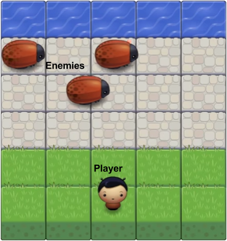

# Classic Arcade game Project

This is the fourth required project on the [Udacity Front End Nanodegree](https://eu.udacity.com/course/front-end-web-developer-nanodegree--nd001).

## How to play

In this game you have a Player and Enemies (Bugs). Your goal is to reach the water, without colliding into any one of the enemies.

At start the Player is located in the grass. There are several Enemies (bugs) which go through three different "roads" (stone boxes) at a random speed. Every time the player collides with an Enemy the game resets. Once the player reaches the water the game is finished.

## Features

* Player can not move off screen
* Enemies cross the screen
* Enemy-player collision resets the game
* Congratulations alert when player wins
* Player selection (pressing space bar key at selection box)

## How to run

### Locally

1. Clone or download[⬇](https://github.com/BycorSanchez/arcade-game/archive/master.zip) the project
2. Open *`index.html`* file using a browser that meets the necessary [requirements](##requirements)

### Online

Live version [https://bycorsanchez.github.io/arcade-game/](https://bycorsanchez.github.io/arcade-game/)

## Requirements

ES6 ([ECMAScript 6](https://www.ecma-international.org/ecma-262/6.0/)) features, such as classes and arrow functions, have been used while developing this game. Therefore a browser which support ES6 is needed in order to run it correctly.
